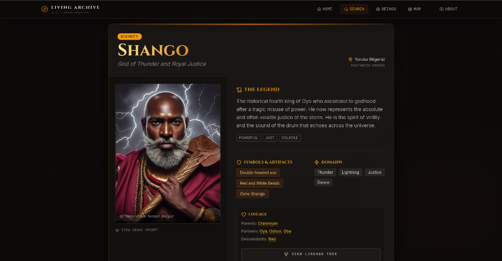
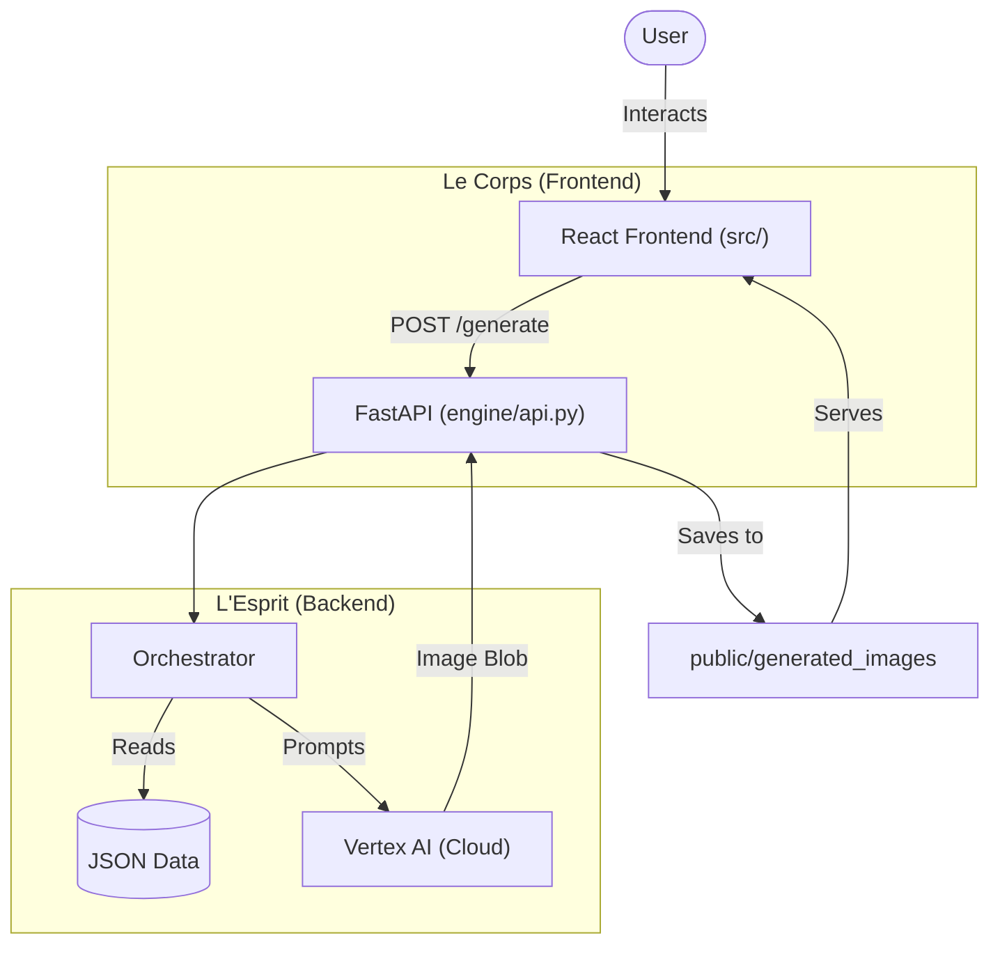

# Living Archive: Encyclopédie Vivante des Mythologies Africaines (V2)

> **"Restoring the visual memory of forgotten pantheons through the lens of AI."**


*(Note for portfolio: Place a hero screenshot here named banner.png)*

## 🌍 The Vision

The **Living Archive** is an interactive digital encyclopedia designed to explore, visualize, and reconstruct the rich tapestry of African Mythologies. Unlike static text archives, this project leverages **Generative AI (Google Vertex AI)** to act as a "visual restoration engine."

It treats mythological data not just as information, but as a prompt for imagination. The system ("L'Esprit") analyzes the attributes of a divinity (Orisha, Loa, Vodun...) and dynamically constructs a hyper-detailed visual manifestation, bridging ancient oral traditions with modern neural rendering.

## 🚀 Capabilities (Current Demo)

This V2 release focuses on the **"Genesis"** capability:

*   **Interactive Entity Cards**: Browse a curated database of African deities (Yoruba, Dogon, Fon, etc.).
*   **Neural Rendering**: A dedicated engine transforms textual descriptions into high-fidelity artistic visualizations using Google Imagen.
*   **Safety & Ethics**: Integrated safety filters ensure respectful representation of cultural heritage.
*   **Lineage Visualization**: Explore relationships between entities via a dynamic lineage tree.



## 🛠️ Tech Stack

The project follows a **Hexagonal Architecture** splitting the "Body" (Frontend) and the "Mind" (Backend).

*   **Frontend ("Le Corps")**:
    *   React 18 + TypeScript
    *   Vite (Build Tool)
    *   Tailwind CSS (Styling & Design System)
    *   Lucide React (Iconography)
*   **Backend ("L'Esprit")**:
    *   Python 3.12
    *   FastAPI (REST Interface)
    *   Pydantic (Strict Data Modeling)
    *   **Google Vertex AI SDK** (Generative Model: Imagen)

## 🏗️ Architecture



### Repository Structure
*   `src/`: The React application and static assets.
*   `engine/`: The Python backend, virtual environment, and orchestration logic.
*   `docs/`: Documentation assets.

## ⚡ Quickstart (Local Development)

### Prerequisites
*   Node.js (v18+)
*   Python (v3.10+)
*   Google Cloud Project with **Vertex AI API** enabled.

### 1. Frontend Setup ("Le Corps")
```bash
# Install dependencies
npm install

# Start the dev server
npm run dev
# > Available at http://localhost:3000
```

### 2. Backend Setup ("L'Esprit")
```bash
cd engine

# Create and activate virtual environment
python3 -m venv venv
source venv/bin/activate  # Windows: venv\Scripts\activate

# Install dependencies
pip install -r requirements.txt

# Start the API server
uvicorn api:app --reload --host 0.0.0.0 --port 8000
# > Health check at http://localhost:8000/health
```

### 3. Environment Variables
Authentication relies on Google Cloud **Application Default Credentials (ADC)**.
Ensure you have authenticated locally:
```bash
gcloud auth application-default login
# Select your project (e.g., livingafricanpantheon)
```
*Note: Ensure your GCP project has billing enabled (Vertex AI is a paid service).*

## 🧪 Testing (Validation Oracle)

We advocate for a robust "Validation Oracle" strategy.

**Backend Tests (Integration & Logic):**
```bash
# Runs integration tests for API & Orchestrator
./engine/venv/bin/pytest engine/tests/integration/test_api_integration.py
```
*Covered: POST /generate success flow, Safety Filter handling (502 error).*

**Frontend Tests (Components):**
```bash
# Runs Vitest smoke tests and EntityCard flows
npx vitest run
```
*Covered: Component rendering, Button interaction, Loading states.*

## 🔧 Troubleshooting

*   **`429 Internal Server Error (Out of Capacity)`**:
    *   *Cause*: Google Vertex AI is temporarily overloaded or you hit your quota.
    *   *Fix*: Wait a few minutes and retry. This is a cloud service limitation, not a code bug.
*   **`502 Bad Gateway (No image returned)`**:
    *   *Cause*: The **Safety Filter** triggered. The prompt generated for this deity might have contained terms flagged by Google's safety models.
    *   *Fix*: Try a different entity (e.g., *Shango* usually works well).
*   **`403 Permission Denied`**:
    *   *Cause*: Your local `gcloud` login is missing or points to a project without Vertex AI enabled.
    *   *Fix*: Run `gcloud auth application-default login` again and check your GCP Console.

## 💰 Costs & Billing
This demo uses generative AI models which incur costs per generation.
*   **Google Imagen**: ~$0.01 - $0.04 per image (estimates vary by region/model).
*   *Tip*: Monitor your usage in the Google Cloud Billing > Reports section.

## 🔮 Roadmap
*   [ ] **Multi-user Isolation**: Move from local file storage to Cloud Storage (GCS/S3) for serving images.
*   [ ] **Narrative Engine**: Integrate LLMs (Gemini Pro) to generate interactive myths and stories.
*   [ ] **Sonic Atmosphere**: Add ambient audio and pronunciation guides.
*   [ ] **Deployment**: Dockerize the engine and deploy to Cloud Run.

## 📜 Legal & disclaimer

This project is an **educational and artistic exploration**. It aims to respect the cultural integrity of African traditions while acknowledging the interpretative nature of AI.
*Data Sources*: Synthesized from academic research and oral tradition compilations.

---
*Built with ❤️ by [Eric Dev] - 2026*
